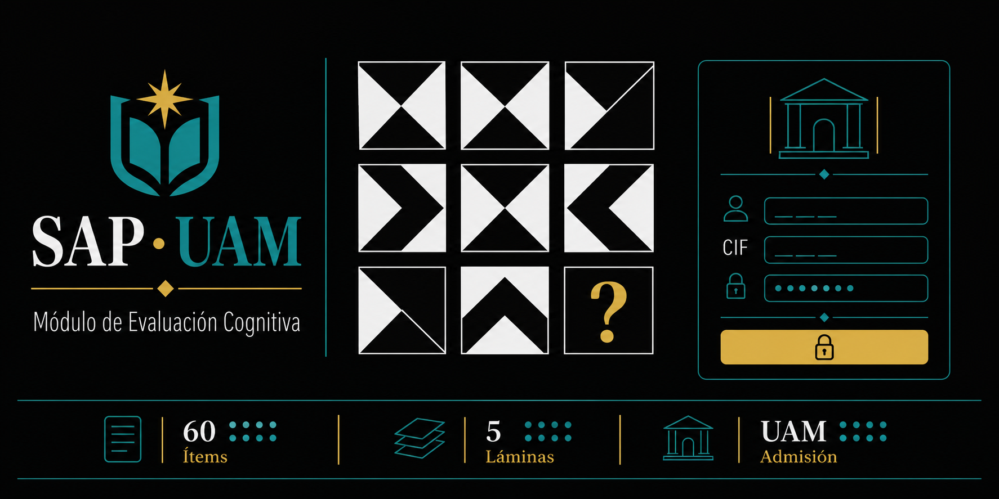

# SAP-UAM · Test de Inteligencia de Weil



Sistema web institucional para la aplicación del **Test de Inteligencia de Weil** en la Universidad Americana (UAM), Nicaragua. Permite el acceso mediante credenciales Moodle UAM o cuenta externa, y administra el proceso completo de evaluación cognitiva.

## Stack

| Capa | Tecnología |
|------|-----------|
| Frontend | HTML, CSS y JavaScript vanilla |
| Backend | Spring Boot 3.3.5 · Java 17 · Spring Security · JPA |
| Base de datos | H2 (desarrollo) · PostgreSQL (producción) |
| Autenticación | JWT propio · integración Moodle server-to-server |

## Estructura

```
sap-uam-weil/
├── frontend/
│   ├── index.html
│   ├── app.js
│   ├── styles.css
│   └── assets/
└── backend/
    ├── pom.xml
    ├── src/main/java/ni/edu/uam/campusfood/
    └── src/main/resources/application.yml
```

## Ejecutar en desarrollo

**Frontend**
```bash
cd frontend
npx serve . -l 8765
# → http://localhost:8765
```

**Backend**
```bash
cd backend
mvn spring-boot:run
# → http://localhost:8080
```

## API de autenticación

| Método | Endpoint | Descripción |
|--------|----------|-------------|
| POST | `/api/auth/moodle-login` | Login con CIF + contraseña UAM |
| POST | `/api/auth/register` | Registro de cuenta externa |
| POST | `/api/auth/login` | Login manual (correo + contraseña) |
| GET | `/api/auth/me` | Sesión activa |
| POST | `/api/auth/logout` | Cierra sesión |

> La contraseña de Moodle y el token de Moodle **nunca se persisten** en base de datos.

## Tests

```bash
cd backend && mvn test
```
